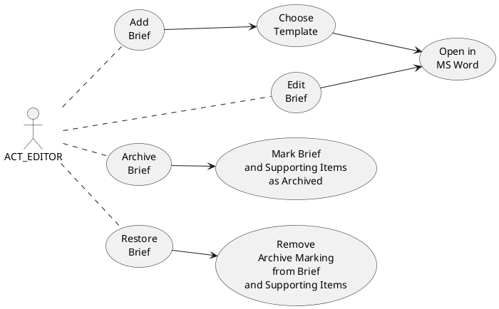

# Manage Document

```plantuml
@startuml
left to right direction

(Add\nBrief) as (add)
(Edit\nBrief) as (edit)
(Archive\nBrief) as (archive)
(Restore\nBrief) as (restore)

(Choose\nTemplate) as (template)
(Open in\nMS Word) as (word)

ACT_EDITOR .. (add)
(add) --> (template)
(template) --> (word)

ACT_EDITOR .. (edit)
(edit) --> (word)

ACT_EDITOR .. (archive)
(archive) --> (Mark Brief\nand Supporting Items\nas Archived)

ACT_EDITOR .. (restore)
(restore) --> (Remove\nArchive Marking\nfrom Brief\nand Supporting Items)

@enduml
```