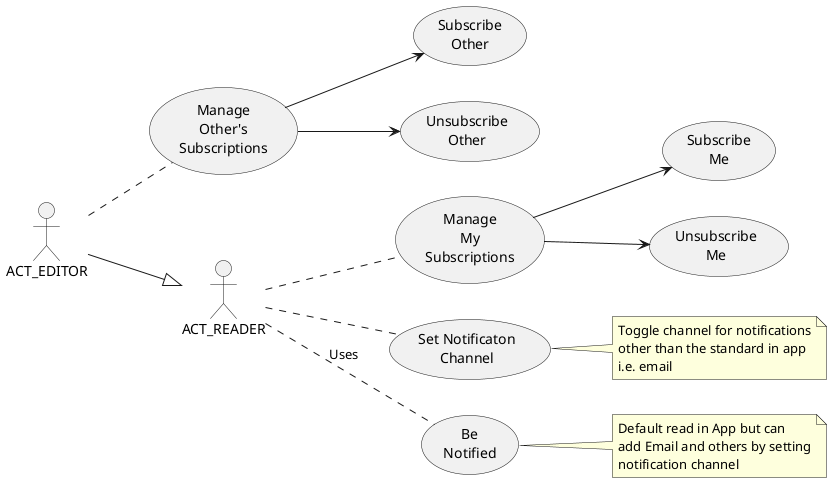

# Manage Notifications

## Fidelity

Readers can increase fidelity but it will clear low fidelity notification subscriptions.

Editior can decrease fidelity but it will clear higher fidelity notification subscriptions.
