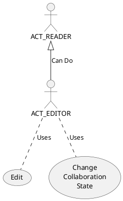

# Editor 

An Editor is able to Collaborate on a Brief they can perform all the actions of a [Reader](reader.md)

- Edit 
    - Brief Material
    - Attachments
- Process   
    - Change Collaboration State

