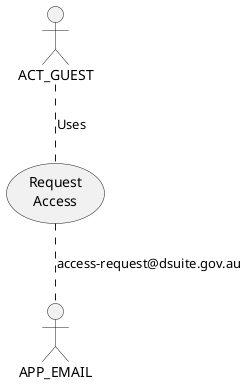

# Guest

A Guest is an Authenticated identity that has no Authorisation. 

- Request Access via Email

```plantuml
@startuml


ACT_GUEST .. (Request\nAccess) : Uses
(Request\nAccess) .down. APP_EMAIL : access-request@dsuite.gov.au

@enduml
```