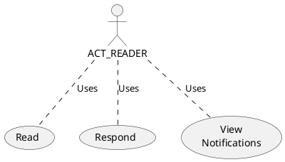

# Reader 

A Reader can consume prepared briefs and perform rudimentary tasks in response to a brief

- Search and Discovery
- Read / View
    - Brief Material
    - Attachments
    - Discussions
    - Recommendations
    - Notifications (about changes)
- Respond
    - Make Comments (Add to Discussion)
    - Choose a Recommendation Response (if they are granted the delegation to do so)

