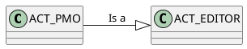

# PMO 

A Parlimentary Officer who works with a Parlimentary VIP i.e. The Prime Minister's Chief of Staff

```plantuml
@startuml
left to right direction

ACT_PMO --|> ACT_EDITOR  : Is a

@enduml
```