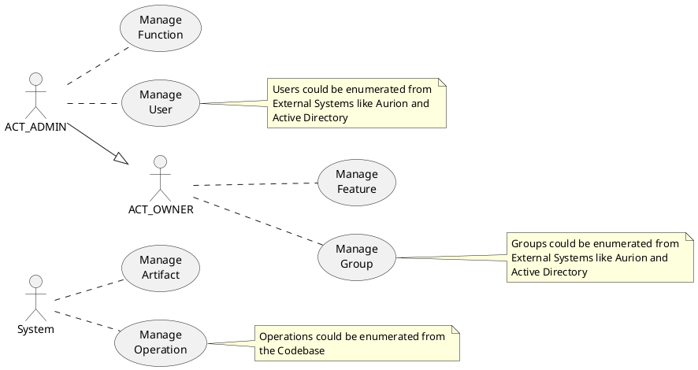

# User Management

CabNet have an Authorisaion Portal that could be whiteboxed to manage Users

```plantuml
@startuml
left to right direction

actor "System"  as ACT_SYS

(Manage\nArtifact) as (mar)
(Manage\nOperation) as (mop)
note right of (mop)
    Operations could be enumerated from 
    the Codebase
end note

(Manage\nFeature) as (mfe)
(Manage\nFunction) as (mfu)
(Manage\nGroup) as (mgr)
note right of (mgr)
    Groups could be enumerated from 
    External Systems like Aurion and
    Active Directory 
end note


(Manage\nUser) as (mus)
note right of (mus)
    Users could be enumerated from 
    External Systems like Aurion and
    Active Directory 
end note

ACT_SYS .. (mop)


ACT_SYS .. (mar)

ACT_ADMIN --|> ACT_OWNER

ACT_OWNER .. (mfe)
ACT_OWNER .. (mgr)

ACT_ADMIN .. (mfu)
ACT_ADMIN .. (mus)

@enduml


```