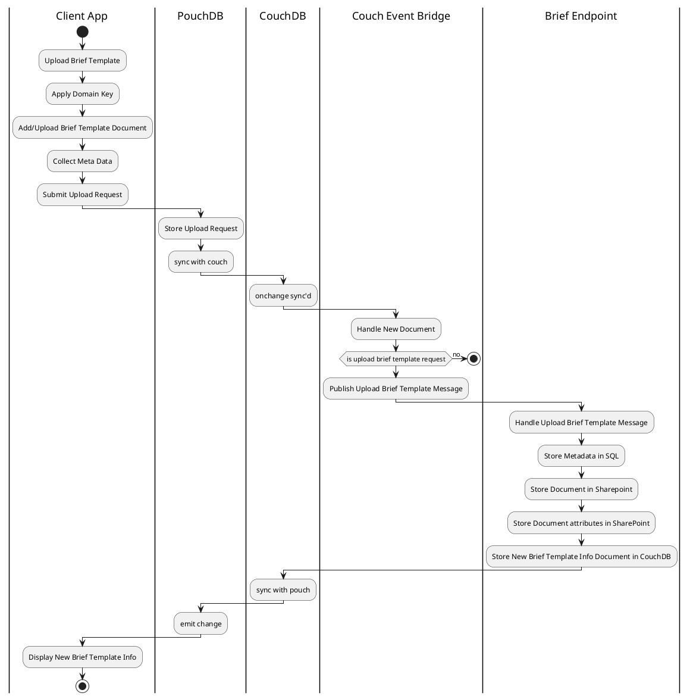

# Upload Brief Template Activity

```plantuml
@startuml
|Client App|
start
:Upload Brief Template;
:Apply Domain Key;
:Add/Upload Brief Template Document;
:Collect Meta Data;
:Submit Upload Request;
|PouchDB|
:Store Upload Request;
:sync with couch;
|CouchDB|
:onchange sync'd;
|Couch Event Bridge|
:Handle New Document;
if (is upload brief template request) then (no)
      stop
endif
:Publish Upload Brief Template Message;
|Brief Endpoint|
:Handle Upload Brief Template Message;
:Store Metadata in SQL;
:Store Document in Sharepoint;
:Store Document attributes in SharePoint;
:Store New Brief Template Info Document in CouchDB;
|CouchDB|
:sync with pouch;
|PouchDB|
:emit change;
|Client App|
:Display New Brief Template Info;
stop

@enduml
```