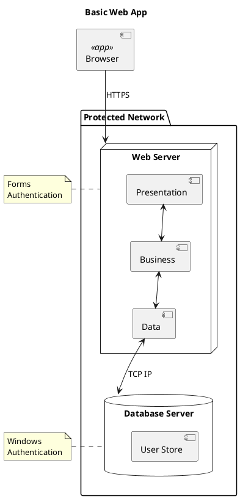

# Web App Server Side

```plantuml
@startuml
title Basic Web App

note "Forms\nAuthentication" as N1
note "Windows\nAuthentication" as N2

component Browser <<app>> as BR

folder "Protected Network" {

    node "Web Server" as WS {
        [Presentation]
        [Business]
        [Data]
    }

    database "Database Server" as DS {
        [User Store]

    }

    BR --> WS : HTTPS 

    [Presentation] <-down-> [Business]
    [Business] <-down-> [Data]
    [Data] <-down-> DS : TCP IP 
    WS .left. N1
    DS .left. N2
@enduml
```