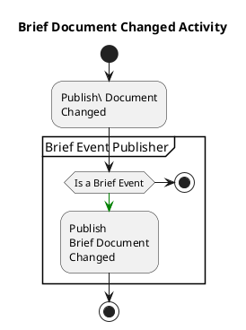

# Brief Document Changed Activity

```plantuml
@startuml

title Brief Document Changed Activity

start
:Publish\ Document\nChanged;

partition "Brief Event Publisher" {
    if (Is a Brief Event) then
        -[#green]->
        :Publish\nBrief Document\nChanged;
    else
        stop
    endif
}

stop

@enduml


```