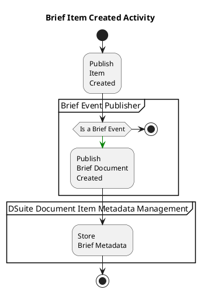

# Brief Item Created Activity

```plantuml
@startuml


title Brief Item Created Activity

start
:Publish\nItem\nCreated;

partition "Brief Event Publisher" {

    if (Is a Brief Event) then
        -[#green]->
        :Publish\nBrief Document\nCreated;
    else
        stop
    endif

}

partition "DSuite Document Item Metadata Management" {
    :Store\nBrief Metadata;
}

stop

@enduml


```