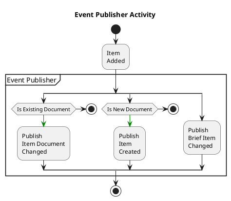

# Event Publisher Activity

```plantuml
@startuml


title Event Publisher Activity

start
:Item\nAdded;

partition "Event Publisher" {

    split
        if (Is Existing Document) then
            -[#green]->
            :Publish\nItem Document\nChanged;
        else
            stop
        endif
    split again
        if (Is New Document) then
            -[#green]->
            :Publish\nItem \nCreated;

        else
            stop
        endif
    split again
        :Publish\nBrief Item\nChanged;

    end split


}

stop

@enduml


```