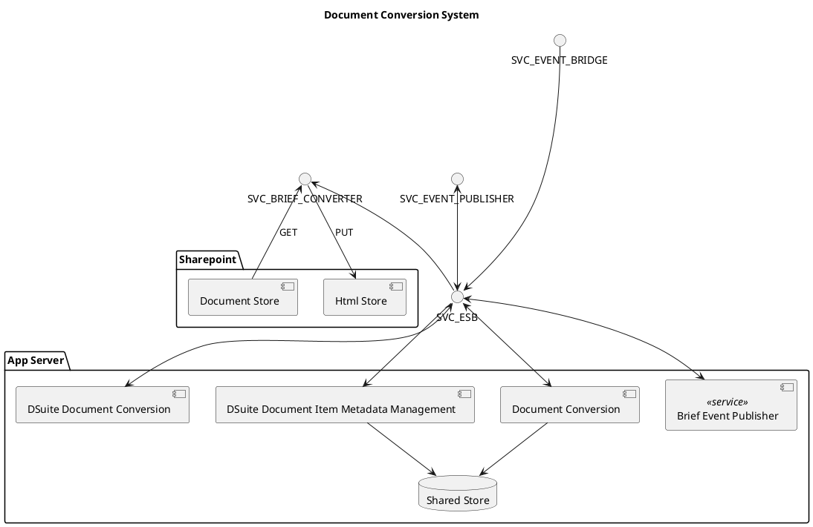

# Document Conversion

## Component Overview

```plantuml
@startuml


title Document Conversion System

folder "Sharepoint" as SP {
    [Document Store] as doclib
    [Html Store] as htmllib

}

folder "App Server" as APP {

    '!include /docs/includes/common.iuml!svc_esb

    component "Brief Event Publisher" <<service>> as BEP

    '!include /docs/includes/common.iuml!svc_event_publisher
    '!include /docs/includes/common.iuml!svc_brief_converter

    [DSuite Document Conversion] as ADC
    [DSuite Document Item Metadata Management] as DIMM
    [Document Conversion] as DC
    database "Shared Store" as SQL


}


SVC_EVENT_BRIDGE ----> SVC_ESB

SVC_ESB <-up-> SVC_EVENT_PUBLISHER
SVC_ESB <-up-> BEP
SVC_ESB -up-> SVC_BRIEF_CONVERTER
SVC_ESB <-right-> ADC
SVC_ESB <-down-> DC
SVC_ESB -down-> DIMM

DC --> SQL
DIMM --> SQL


SVC_BRIEF_CONVERTER <-- doclib : GET
SVC_BRIEF_CONVERTER --> htmllib : PUT

@enduml


```
