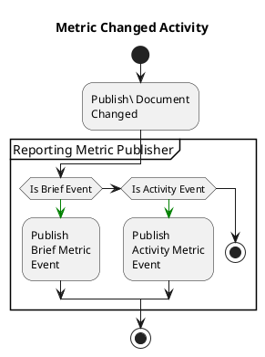

# Collect Data

```plantuml
@startuml

title Metric Changed Activity

start
:Publish\ Document\nChanged;

partition "Reporting Metric Publisher" {
    if (Is Brief Event) then
        -[#green]->
        :Publish\nBrief Metric\nEvent;
    else if (Is Activity Event) then
        -[#green]->
        :Publish\nActivity Metric\nEvent;
    else
        stop
    endif
}

stop

@enduml


```
