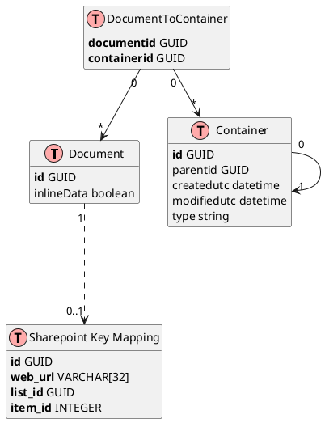

# EF DataModel

```plantuml
@startuml
' uncomment the line below if you're using computer with a retina display
' skinparam dpi 300
!define Table(name,desc) class name as "desc" << (T,#FFAAAA) >>
' we use bold for primary key
' green color for unique
' and underscore for not_null
!define primary_key(x) <b>x</b>
!define unique(x) <color:green>x</color>
!define not_null(x) <u>x</u>
' other tags available:
' <i></i>
' <back:COLOR></color>, where color is a color name or html color code
' (#FFAACC)
' see: http://plantuml.com/classes.html#More
hide methods
hide stereotypes

' entities

Table(document, "Document") {
    primary_key(id) GUID
    inlineData boolean
}

Table(container, "Container") {
    primary_key(id) GUID
    parentid GUID 
    createdutc datetime
    modifiedutc datetime
    type string
}

Table(documentcontainer, "DocumentToContainer") {
    primary_key(documentid) GUID
    primary_key(containerid) GUID
}

Table(ext_key_sp, "Sharepoint Key Mapping") {
    primary_key(id) GUID
    primary_key(web_url) VARCHAR[32]
    primary_key(list_id) GUID
    primary_key(item_id) INTEGER
}


' relationships
container "0" --> "1" container 
documentcontainer "0" --> "*" container 
documentcontainer "0" --> "*" document 
document  "1" ...> "0..1" ext_key_sp 

@enduml
```