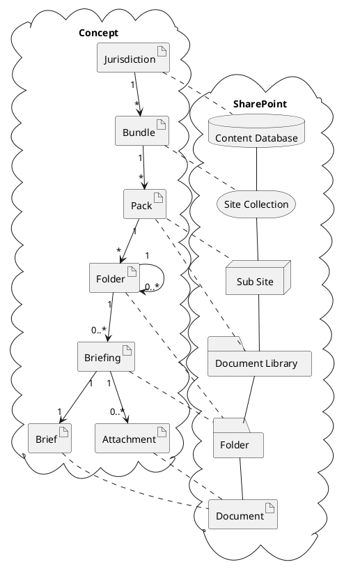

# SharePoint

Briefs and attachments are managed in SharePoint document libraries

```plantuml
@startuml

cloud Concept {
    artifact  "Jurisdiction" as jurisdiction
    artifact  "Bundle" as bundle
    artifact  "Pack" as pack
    artifact  "Folder" as folder
    artifact  "Briefing" as briefing
    artifact  "Brief" as brief
    artifact  "Attachment" as attachment

    jurisdiction "1" --> "*" bundle 
    bundle "1" --> "*" pack 
    pack "1" --> "*" folder
    folder "1" --> "0..*" folder 
    folder "1" --> "0..*" briefing  
    briefing "1" --> "1" brief 
    briefing "1" --> "0..*" attachment 

}

cloud SharePoint {
    database "Content Database" as contentdb
    storage  "Site Collection" as sitecollection
    node "Sub Site" as subsite
    folder "Document Library" as doclib
    folder "Folder" as docfolder
    artifact "Document" as document

    contentdb -- sitecollection 
    sitecollection -- subsite 
    subsite -- doclib
    doclib -- docfolder 
    docfolder -- document 
}


' relationships

jurisdiction  .. contentdb 
bundle .. sitecollection 
pack .. subsite 
pack .. doclib 
folder .. docfolder 
briefing .. docfolder 
brief .. document
attachment .. document


@enduml
```