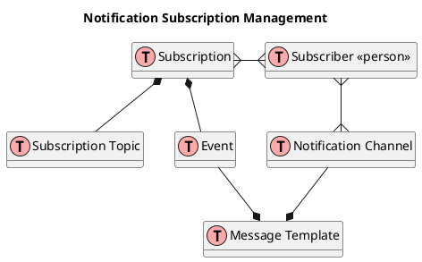

# Notification

## ER Diagram

## Definition

Message Templates are determined by a Subscribers current set of Notifications Channels. By default notifications occur within the system on the user's Home Page but they can add email as well
