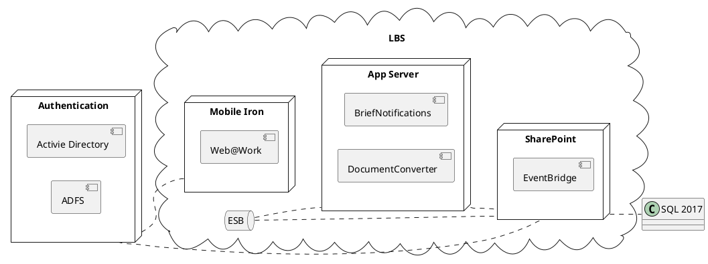

# LBS

```plantuml
@startuml
allow_mixing
left to right direction

node "Authentication" {
    component "Activie Directory"
    component "ADFS"
}

cloud "LBS" {
node "SharePoint" {
    component "EventBridge"
}

node "Mobile Iron" {
    component "Web@Work"
}

node "App Server" {
    component "BriefNotifications"
    component "DocumentConverter"

}

queue "ESB"

}

"Authentication" .. "Mobile Iron"
"Authentication" .. "SharePoint"

"ESB" ..  "SharePoint"
"ESB" .. "App Server"

"SharePoint" .. "SQL 2017"
"App Server" .. "SharePoint"


@enduml
```