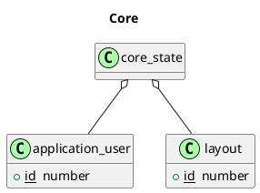

# Core

## ER Diagram

```plantuml
@startuml
' uncomment the line below if you're using computer with a retina display
' skinparam dpi 300
!define Abstract(name,desc) abstract class name as "desc" << (A,#FFAAAA) >>
!define Class(name,desc) class name as "desc" << (C,#AAFFAA) >>
!define Interface(name,desc) interface name as "desc" << (I,#AAAAFF) >>
!define Enum(name,desc) enum name as "desc" << (E,#FFFFAA) >>

!define key(x) <u>x</u>
!define nullable(x) <u>x</u>
!define private(x) -x
!define public(x) +x
!define package_private(x) ~x
!define protected(x) #x
hide methods
hide stereotypes

title Core

' entities

Class(_core_state, "core_state") {
    
}

Class(_user, "application_user") {
    public(key(id))  number
}

Class(_layout, "layout") {
    public(key(id))  number
}


' relationships
_core_state o-- _user
_core_state o-- _layout

@enduml

```