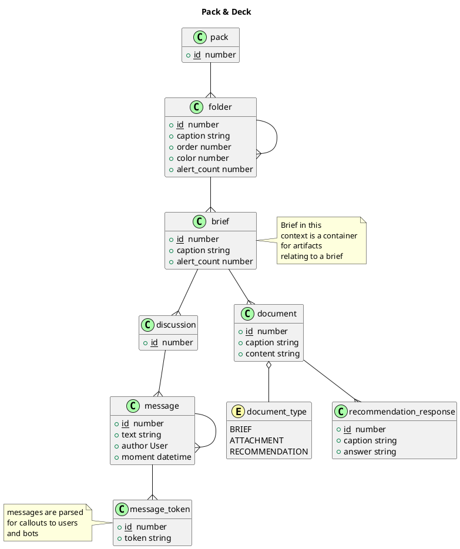

# Pack and Deck

## ER Diagram

```plantuml
@startuml
' uncomment the line below if you're using computer with a retina display
' skinparam dpi 300
!define Abstract(name,desc) abstract class name as "desc" << (A,#FFAAAA) >>
!define Class(name,desc) class name as "desc" << (C,#AAFFAA) >>
!define Interface(name,desc) interface name as "desc" << (I,#AAAAFF) >>
!define Enum(name,desc) enum name as "desc" << (E,#FFFFAA) >>

!define key(x) <u>x</u>
!define nullable(x) <u>x</u>
!define private(x) -x
!define public(x) +x
!define package_private(x) ~x
!define protected(x) #x
hide methods
hide stereotypes

title Pack & Deck

Class(_pack, "pack") {
    public(key(id))  number
}

Class(_folder, "folder") {
    public(key(id))  number
    public(caption) string
    public(order) number  
    public(color) number  
    public(alert_count) number 
}

Class(_brief, "brief") {
    public(key(id))  number
    public(caption) string
    public(alert_count) number 
}

note right of _brief {
    Brief in this 
    context is a container
    for artifacts 
    relating to a brief
}

Class(_discussion, "discussion") {
    public(key(id))  number
}

Class(_message, "message") {
    public(key(id))  number
    public(text) string
    public(author) User
    public(moment) datetime  
}

Class(_message_token, "message_token") {
    public(key(id))  number
    public(token) string
}

note left of _message_token {
    messages are parsed
    for callouts to users 
    and bots
}

Class(_document, "document") {
    public(key(id))  number
    public(caption) string
    public(content) string 
}

Enum(_document_type, "document_type") {
    BRIEF
    ATTACHMENT
    RECOMMENDATION
}

Class(_recommendation_response, "recommendation_response") {
    public(key(id))  number
    public(caption) string
    public(answer) string 
}


' relationships


_pack --{ _folder
_folder --{ _folder
_folder --{ _brief

_brief --{ _document
_document o-- _document_type
_document --{ _recommendation_response

_brief --{ _discussion

_discussion --{ _message
_message --{ _message
_message -down-{ _message_token

@enduml

```