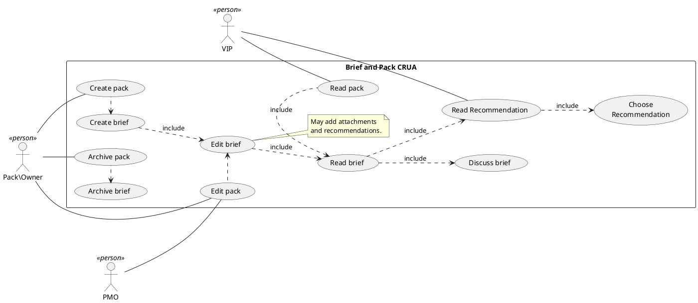

# DSuite

DSuite is a collection of tools designed to provide an Executive Decision Information Management System (EDIM).

It is designed to deliver enhanced communication and discovery of important information to very important people (VIPs).

!!! quote 
    DSuite is a software system I can use to brief a VIP

## Use Case

