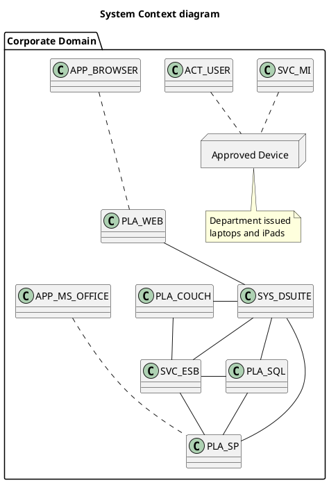

# Software System

This is a zoomed out view showing the big picture of the system. Here we are focusing on people and software systems rather than technologies, protocols and other low-level details.

DSuite uses platforms and applications that we already have and use regularly use. It is secured by the Corporate network

!!! warning
    Do Not Assume subjects not explicitly included in these documents
    have not been considered. This documentation is capturing subjects that
    are not self evident or topics that have come up during development
    that have needed some explanation
