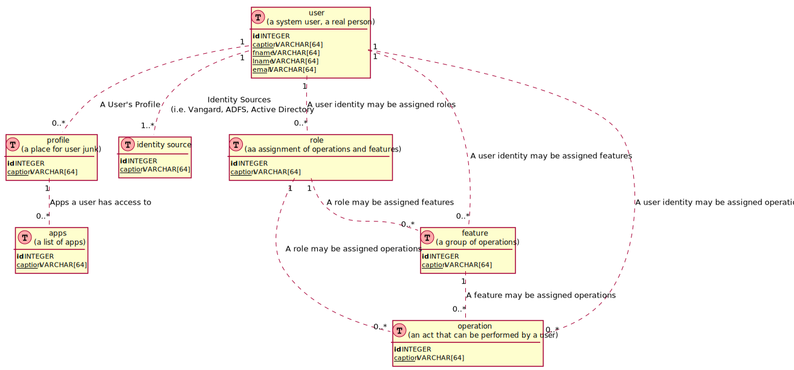

# User Management

This model defines the security for the application 

> _IMPORTANT_ This does not secure artefacts managed outside the system. It provides data that would be applied to external systems. The _identity source_ describes where the identity comes from 

- Identity
    - A real person who may have one or more identities managed elsewhere i.e. Active Directory, Vangard, SharePoint
- App
    - DSuite is built from multiple apps. Access to individual apps may be different depending on Identity
- Personalisation _Nice to Have_
    - Key Value pairs to set values for personalisation
- Profile _development and collaboration_
    - an Identity might have different profiles for different apps
- Role, Features & Operations
    - application operations grouped up by diferent levels

--- 

## ER Diagram

[PNG](access_er.png) | [SVG](access_er.svg)

---