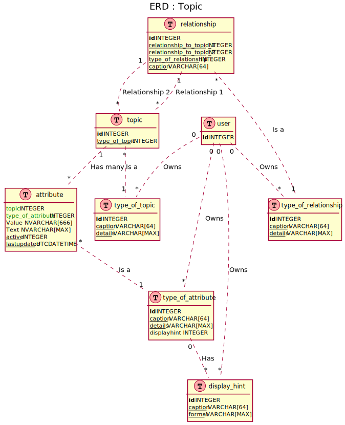

# User Defined Topics

Very often adhoc information stores to be added to a DataStore

This design allows for diverse data needs

---

## How to enter data

- Add a 'type of topic'
- Add a 'type of attribute' for each attribute a topic has
- If the topic has relationships Add a 'type of relationship'
    - it could describe a relationship to another topic
    - it could be a parent child relationship for a single topic
    - it could describe a relationship to an item in another system
- Assign a User (subject matter expert) to each of these types 
    - someone who can explain why the topic, attribute or relationship needs to exist
    - reason could also be captured as a topic with attributes & relationship etc.
- Enter data into the Topic, Attribute & Relationship tables

---

## How to query data

```SQL 

-- This is (pseudo-code)
DECLARE @topic_type_id int 
SET @topic_type_id = 1 -- whatever you are after

SELECT *
(
    SELECT a.type_of_attribute as t, a.Value as v
    FROM [attributes] a
        INNER JOIN [topic] tp
            ON tp.id = a.topic
            AND tp.type_of_topic IS @topic_type_id
) src
PIVOT
(
    MAX(v)
    FOR attrs in ([1], [2], [3], ... )
)

---
```
## ER Diagram



[PNG](topic.png) | [SVG](topic.svg)

