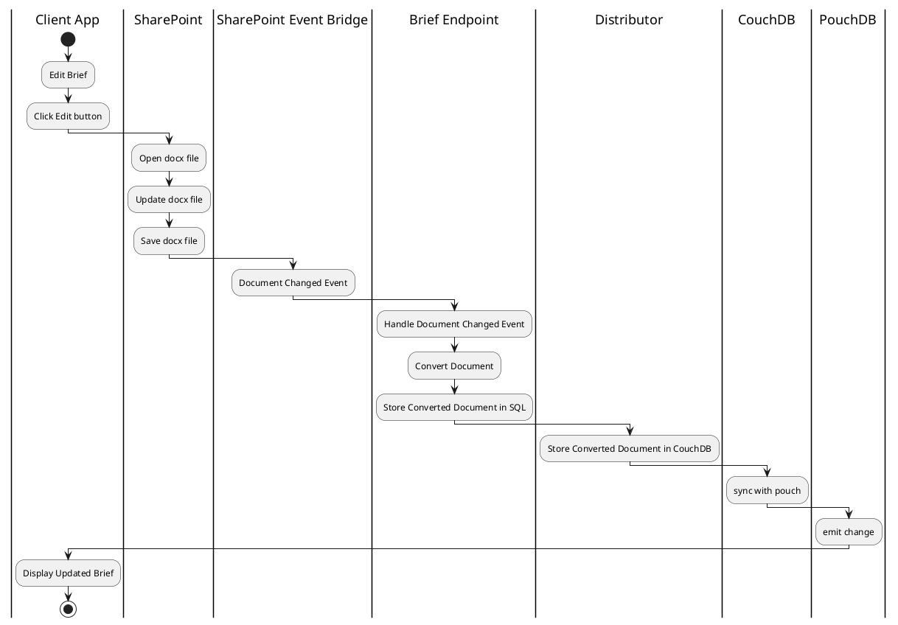

# Update Brief Document Activity

```plantuml format="svg" classes="uml myDiagram"
@startuml
|Client App|
start
:Edit Brief;
:Click Edit button;
|SharePoint|
:Open docx file;
:Update docx file;
:Save docx file;
|SharePoint Event Bridge|
:Document Changed Event;
|Brief Endpoint|
:Handle Document Changed Event;
:Convert Document;
:Store Converted Document in SQL;
|Distributor|
:Store Converted Document in CouchDB;
|CouchDB|
:sync with pouch;
|PouchDB|
:emit change;
|Client App|
:Display Updated Brief;
stop

@enduml
```