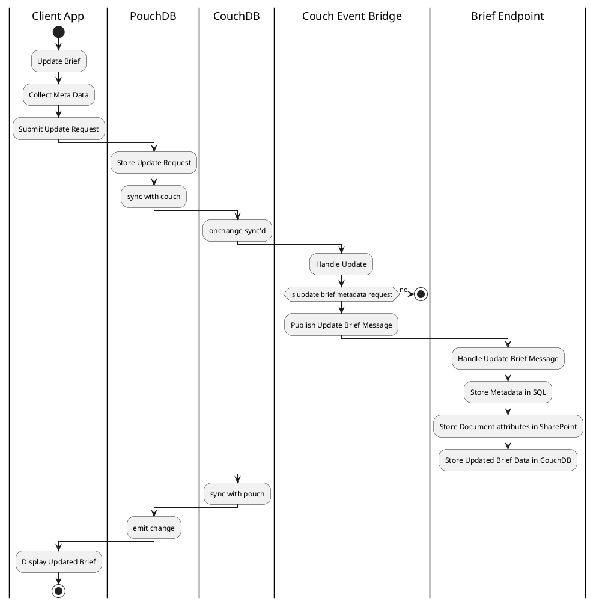

# Update Brief Metadata Activity

```plantuml format="svg" classes="uml myDiagram"
@startuml
|Client App|
start
:Update Brief;
:Collect Meta Data;
:Submit Update Request;
|PouchDB|
:Store Update Request;
:sync with couch;
|CouchDB|
:onchange sync'd;
|Couch Event Bridge|
:Handle Update;
if (is update brief metadata request) then (no)
      stop
endif
:Publish Update Brief Message;
|Brief Endpoint|
:Handle Update Brief Message;
:Store Metadata in SQL;
:Store Document attributes in SharePoint;
:Store Updated Brief Data in CouchDB;
|CouchDB|
:sync with pouch;
|PouchDB|
:emit change;
|Client App|
:Display Updated Brief;
stop

@enduml
```