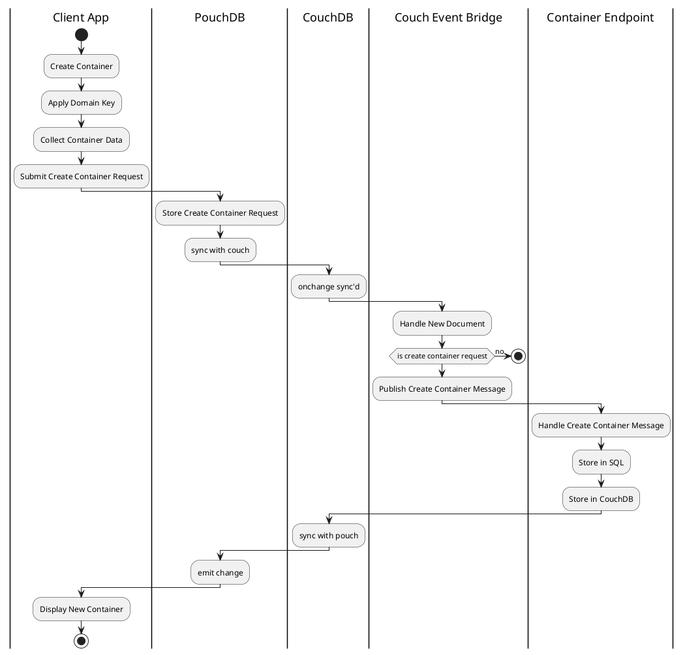

# Create Container Activity

```plantuml format="svg" classes="uml myDiagram"
@startuml
|Client App|
start
:Create Container;
:Apply Domain Key;
:Collect Container Data;
:Submit Create Container Request;
|PouchDB|
:Store Create Container Request;
:sync with couch;
|CouchDB|
:onchange sync'd;
|Couch Event Bridge|
:Handle New Document;
if (is create container request) then (no)
      stop
endif
:Publish Create Container Message;
|Container Endpoint|
:Handle Create Container Message;
:Store in SQL;
:Store in CouchDB;
|CouchDB|
:sync with pouch;
|PouchDB|
:emit change;
|Client App|
:Display New Container;
stop

@enduml
```