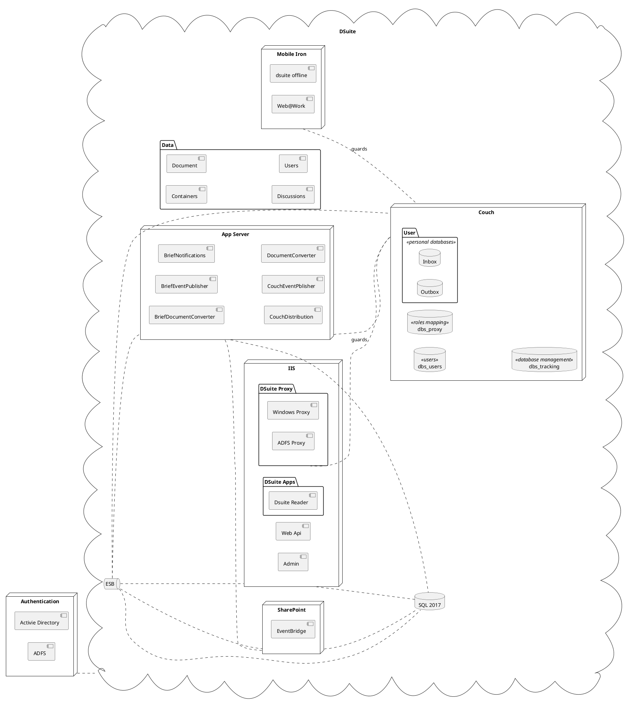

# DSuite

```plantuml format="svg" classes="uml myDiagram"
@startuml
allow_mixing
left to right direction

node "Authentication" {
    component "Activie Directory"
    component "ADFS"
}

cloud "DSuite" {
node "SharePoint" {
    component "EventBridge"
}

node "IIS" {
    folder "DSuite Proxy" {
        component "Windows Proxy"
        component "ADFS Proxy"
    }

    folder "DSuite Apps" {
        component "Dsuite Reader"
    }
    component "Web Api"
    component "Admin"
}

node "Mobile Iron" {
    component "dsuite offline"
    component "Web@Work"
}


node "App Server" {
    component "BriefDocumentConverter"
    component "BriefEventPublisher"
    component "BriefNotifications"
    component "CouchDistribution"
    component "CouchEventPblisher"
    component "DocumentConverter"

}

database "SQL 2017"  {
    folder "DSuite.Data" {
        component "Containers"
        component "Document"
        component "Discussions"
        component "Users"
    }
}

node "Couch"  {
    database dbs_users <<users>>
    database dbs_proxy <<roles mapping>>
    database dbs_tracking <<database management>>

    folder "User" <<personal databases>> {
        database "Inbox"
        database "Outbox"
    }

}

queue "ESB"

}

"Authentication" .. "DSuite"
"DSuite Proxy" .. "Couch" : guards
"Mobile Iron" .. "Couch" : guards

"ESB" ..  "IIS"
"ESB" ..  "App Server"
"ESB" ..  "SharePoint"
"ESB" ..  "SQL 2017"
"ESB" ..  "Couch"

"SharePoint" .. "SQL 2017"
"IIS" .. "SQL 2017"
"App Server" .. "SQL 2017"
"App Server" .. "SharePoint"
"App Server" .. "Couch"

@enduml
```