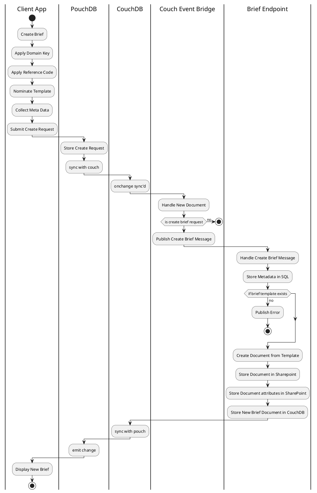

# Create Brief from Template Activity

```plantuml format="svg" classes="uml myDiagram"
@startuml
|Client App|
start
:Create Brief;
:Apply Domain Key;
:Apply Reference Code;
:Nominate Template;
:Collect Meta Data;
:Submit Create Request;
|PouchDB|
:Store Create Request;
:sync with couch;
|CouchDB|
:onchange sync'd;
|Couch Event Bridge|
:Handle New Document;
if (is create brief request) then (no)
      stop
endif
:Publish Create Brief Message;
|Brief Endpoint|
:Handle Create Brief Message;
:Store Metadata in SQL;
if (if brief template exists) then (no)
      :Publish Error;
      stop
endif
:Create Document from Template;
:Store Document in Sharepoint;
:Store Document attributes in SharePoint;
:Store New Brief Document in CouchDB;
|CouchDB|
:sync with pouch;
|PouchDB|
:emit change;
|Client App|
:Display New Brief;
stop

@enduml
```