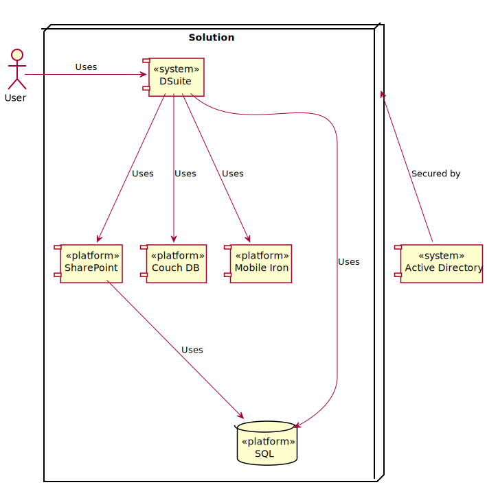
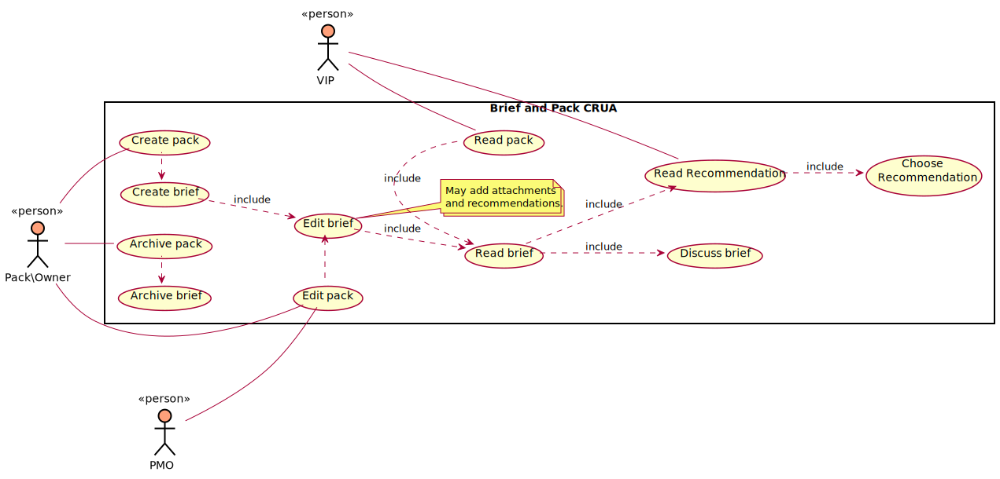

# What is DSuite

DSuite is a collection of tools designed to provide an Executive Decision Information Management System (EDIM).

It is designed to deliver enhanced communication and discovery of important information to very important people (VIPs).

## Overview

DSuite uses platforms and applications that we already have and use regularly use. It is secured by the Corporate network

[PNG](overview.png) | [SVG](overview.svg)

---

[PNG](use_case.png) | [SVG](use_case.svg)

