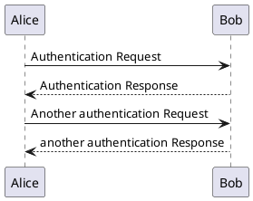

hero: Markdown examples hero
title: Markdown examples
description: Nullam urna elit, malesuada eget finibus ut, ac tortor.

# Markdown examples

DSuite is an Executive Decision Information Management System (EDIM).

It is designed to deliver enhanced communication and discovery of important information to very important people (VIPs).

## Note Example

!!! note
    Lorem ipsum dolor sit amet, consectetur adipiscing elit. Nulla et euismod
    nulla. Curabitur feugiat, tortor non consequat finibus, justo purus auctor
    massa, nec semper lorem quam in massa.


## Code Highlight

``` C#
public static void Send(
    Socket socket, byte[] buffer, int offset, int size, int timeout) {
  int startTickCount = Environment.TickCount;
  int sent = 0;
  do {
    if (Environment.TickCount > startTickCount + timeout)
      throw new Exception("Timeout.");
    try {
      sent += socket.Send(buffer, offset + sent,
        size - sent, SocketFlags.None);
    } catch (SocketException ex) {
      if (ex.SocketErrorCode == SocketError.WouldBlock ||
          ex.SocketErrorCode == SocketError.IOPending ||
          ex.SocketErrorCode == SocketError.NoBufferSpaceAvailable) {
        /* Socket buffer is probably full, wait and try again */
        Thread.Sleep(30);
      } else {
        throw ex;
      }
    }
  } while (sent < size);
}

```

## UML

This will work soon I promise




## Random Links

- [iOS USB](http://thecodewash.blogspot.com.au/2017/05/communicating-with-your-ios-app-over.html)

## Footnote Example

Lorem ipsum[^1] dolor sit amet, consectetur adipiscing elit.[^2]


## Footnotes

[^1]: Lorem ipsum dolor sit amet, consectetur adipiscing elit.


[^2]:
    Lorem ipsum dolor sit amet, consectetur adipiscing elit. Nulla et euismod
    nulla. Curabitur feugiat, tortor non consequat finibus, justo purus auctor
    massa, nec semper lorem quam in massa.