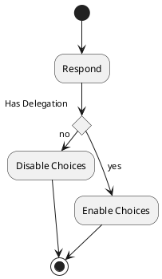

# Respond to recommendation

```plantuml format="svg" classes="uml myDiagram"
@startuml

(*) --> "Respond"

if "Has Delegation" then
  -->[yes] "Enable Choices"
  --> (*)
else
  ->[no] "Disable Choices"
  --> (*)
endif

@enduml
```